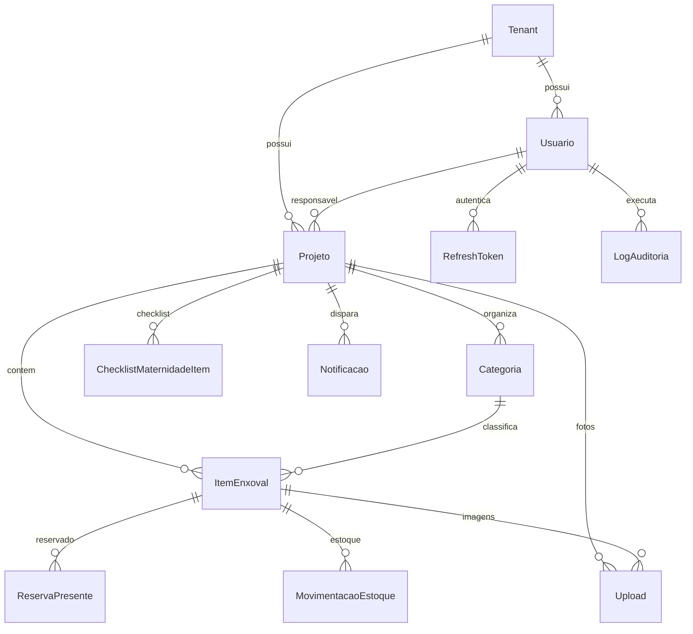

# ERD inicial

```mermaid
erDiagram
  Tenant ||--o{ Usuario : possui
  Tenant ||--o{ Projeto : possui
  Usuario ||--o{ Projeto : responsavel
  Usuario ||--o{ RefreshToken : autentica
  Usuario ||--o{ LogAuditoria : executa
  Projeto ||--o{ Categoria : organiza
  Projeto ||--o{ ItemEnxoval : contem
  Categoria ||--o{ ItemEnxoval : classifica
  ItemEnxoval ||--o{ ReservaPresente : reservado
  Projeto ||--o{ ChecklistMaternidadeItem : checklist
  ItemEnxoval ||--o{ MovimentacaoEstoque : estoque
  Projeto ||--o{ Upload : fotos
  ItemEnxoval ||--o{ Upload : imagens
  Projeto ||--o{ Notificacao : dispara
```

O desenho ja considera multi-tenant, soft delete nos cadastros principais, auditoria e extensoes para SaaS/white label.
